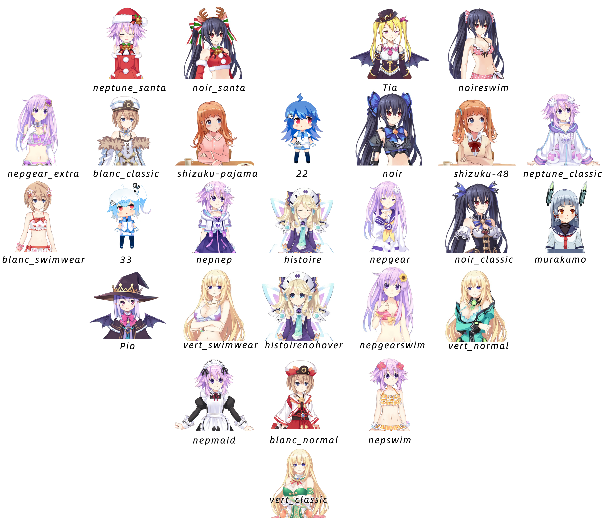

# live2d_models

## 🌏 模型预览
[我的网站](https://mynamecoder.com/)
[完整功能](https://mi.js.org/live2d-widget/demo/demo.html)

## 📷 预览图

## 配合框架使用
框架链接：[stevenjoezhang/live2d-widget](https://github.com/WhenCoding/live2d-widget)

## 文件说明
| 文件名 | 说明 |
| :-: | :-: |
| model_list_all.json| 所有模型 |
| model_list.json | 使用的模型，使用哪些就配置哪些 |